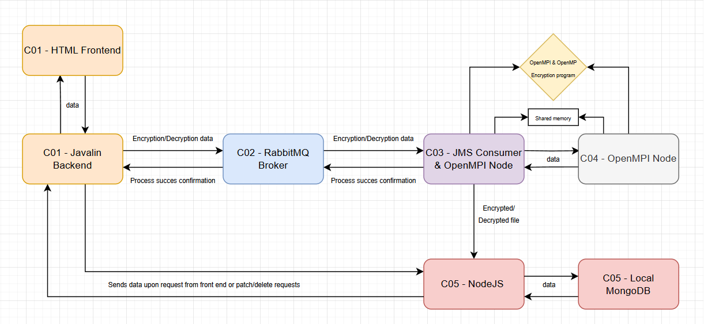

# Encryption-Decryption-Distributed-Parallel-Web-Project
(ISM-DAD Project) by Marius Ioan Rusu

This AES Encryptor & Decryptor web app allows you to securely encrypt or decrypt files using the AES algorithm with selectable key lengths and modes. The interface is simple and designed to be user-friendly, helping you protect your sensitive data with robust encryption, using distributed & parallel systems for higher performance in the encryption/decryption process.

The application supports AES 128-bit and 256-bit encryption modes, along with ECB and CBC modes. You can upload your files, set passwords, and manage encryption parameters easily.

---

## Project Structure
```bash
├── C01_BackEnd_Javalin
│ ├── fileInput # Input files for Java backend processing
│ ├── lib # External libraries for Java backend
│ ├── out # Java compiled output
│ ├── src # Java source code
│ ├── target # Maven build target folder
│ └── .vscode # VSCode project config
│
├── C02_RabbitMQBroker # RabbitMQ broker Docker setup and config
│
├── C04_OpenMPI_Extra_Client
│ ├── java-app # Java MPI client source and config (This is C03 - JMS Consumer that receives the data from C01 and runs the OpenMPI & OpenMP process alongside C04 - MPI Node)
│ ├── mpi-node # MPI node Docker build and config (this is C04 - MPI Node)
│ └── .vscode # VSCode project config
│
├── C05_NodeJs_MongoDB
│ ├── server # Node.js server code
│ │ ├── db # MongoDB connection setup
│ │ └── routes # Express routes for API
│ └── node_modules # Node dependencies
│
└── docker-compose.yml # Docker Compose orchestration file
```
---



---

## Component Overview

### 1. `C01_BackEnd_Javalin`
- Java backend built on Javalin framework.
- Responsible for processing input files stored in `fileInput`.
- Communicates with RabbitMQ for messaging tasks.

### 2. `C02_RabbitMQBroker`
- RabbitMQ message broker service.
- Handles messaging and queueing between the backend and MPI clients.
- Includes health checks for service availability.

### 3. `C04_OpenMPI_Extra_Client` - Has containers C03 and C04 (C03 is the JMS consumer)
- MPI client nodes implemented in Java and MPI.
- Processes distributed computational tasks.
- Communicates with RabbitMQ and shares data via volumes (receives request from C01 for encryption/decryption and responds with theresult status through JMS, while also sending the data to C05 - Node.JS).

### 4. `C05_NodeJs_MongoDB`
- Node.js with Express API server.
- Connects to a local MongoDB database.
- Implements CRUD operations on `data` collection.
- Supports file upload/download via GridFS.
- Implements password verification and updating IV (initialization vector) for requests.
- Routes include `/database` with endpoints (primarily used by C01 Javalin Backend & C03 JMS Consumer):
  - GET `/` — Retrieve 50 posts
  - POST `/receiveInputedData` — Get posts by array of IDs
  - POST `/receive-form` — Insert new post
  - DELETE `/:id` — Delete post and associated GridFS file
  - POST `/uploadProcessedFile` — Upload a file and link it to a post
  - GET `/download/final/:docId` — Download linked GridFS file
  - PATCH `/updateIv/:id` — Update request IV
  - POST `/check-password/:id` — Verify post password

---

## How to Build and Run

1. **Install Docker and Docker Compose** on your machine.

2. **Create the external Docker network** if it does not exist:

   ```bash
   docker network create ism-dad-network
   ```
   
3. **Build and start all services** (you need you be in the root path, where the main docker-compose.yl file is):

   ```bash
   docker-compose up --build
   ```

4. **Access the the webpage**:

   [http://localhost:7000/main.html](http://localhost:7000/main.html)

---
  
## Notes:

- The Java backend reads input files from the mounted fileInput directory (meant for temporary storage for further sending to C03 JMS Consumer for processing).
- The Node.js API interacts with MongoDB and uses GridFS for file storage.
- RabbitMQ manages messaging queues between the Java backend and MPI clients.
- MPI clients perform distributed & parallel processing and share data through mounted volumes.
- Volumes and networks are configured to enable smooth communication between services.
 

## Docker Compose Setup

```yaml
version: "3.8"

services:
  c01-javalin:
    user: root
    build:
      context: ./C01_BackEnd_Javalin
    container_name: c01-javalin
    depends_on:
      c02-rabbitmq:
        condition: service_healthy
    ports:
      - "7000:7000"
    volumes:
      - ./C01_BackEnd_Javalin/fileInput:/app/fileInput
    networks:
      - ism-dad-network

  c02-rabbitmq:
    build:
      context: ./C02_RabbitMQbroker
      dockerfile: Dockerfile
    container_name: c02-rabbitmq
    ports:
      - "5672:5672"
      - "15672:15672"
    networks:
      - ism-dad-network
    healthcheck:
      test: ["CMD", "rabbitmq-diagnostics", "ping"]
      interval: 10s
      timeout: 5s
      retries: 5

  c03-jms-consumer:
    build:
      context: ./C04_OpenMPI_Extra_Client
      dockerfile: java-app/Dockerfile
    container_name: c03-jms-consumer
    depends_on:
      c02-rabbitmq:
        condition: service_healthy
    cap_add:
      - NET_BIND_SERVICE
    environment:
      - OMP_NUM_THREADS=4
    volumes:
      - shared-data:/home/mpiuser/data
    tty: true
    ports:
      - "16100:16161/udp"
    networks:
      ism-dad-network:
      mpi-net:
        ipv4_address: 172.28.0.2
    restart: unless-stopped

  c04-mpi-node:
    build:
      context: ./C04_OpenMPI_Extra_Client
      dockerfile: mpi-node/Dockerfile
    container_name: c04-mpi-node
    environment:
      - OMP_NUM_THREADS=4
    volumes:
      - shared-data:/home/mpiuser/data
    tty: true
    ports:
      - "16101:16161/udp"
    networks:
      ism-dad-network:
      mpi-net:
        ipv4_address: 172.28.0.3

  c05-mongodb:
    image: mongo:6.0
    container_name: c05-mongodb
    ports:
      - "27017:27017"
    volumes:
      - mongodata:/data/db
    networks:
      - ism-dad-network

  c05-nodejs:
    build:
      context: ./C05_NodeJs_MongoDB
      dockerfile: Dockerfile
    container_name: c05-nodejs
    ports:
      - "5050:5050"
    environment:
      - MONGO_URI=mongodb://c05-mongodb:27017
    depends_on:
      - c05-mongodb
    networks:
      ism-dad-network:
        aliases:
          - c05-nodejs

networks:
  ism-dad-network:
    external: true

  mpi-net:
    driver: bridge
    ipam:
      config:
        - subnet: 172.28.0.0/16

volumes:
  shared-data:
  mongodata:
